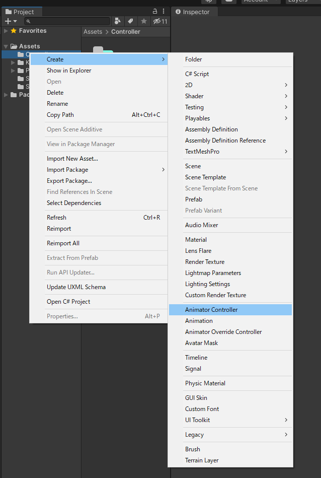
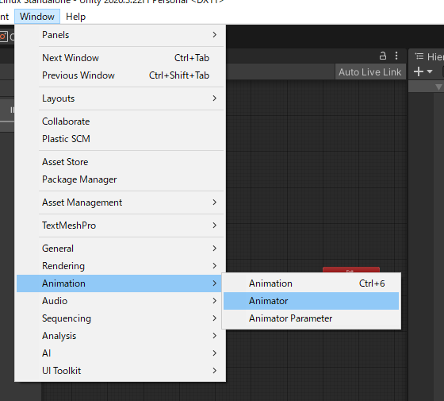
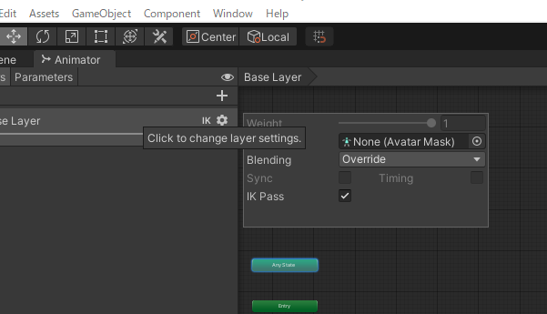
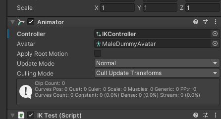

# Humanoid IK

Sample Using Inverse Kinematics in Unity.

## Developing

---

### Setting up Dev

Create an Animator controller in the Projects view.  

Open the animator tab.  

Enable IK Pass.  

Apply controller to the animator of the model you wish to move.  

## Tests

---

mp4 ver : [docs/demo/HumanoidIK_Demo.mp4](docs/demo/HumanoidIK_Demo.mp4)

## References
- [Unity 手書きでさくっとIK (Inverse Kinematics) - Qiita](https://qiita.com/three_0_3/items/4cd316c71ccc3439a3f0)